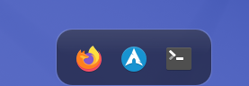

<div align="center">



# shelf

### the family's dock.

**standalone wayland dock for kde plasma — glass morphism, parabolic zoom, auto-hide**

</div>

---

## what is shelf?

shelf is a standalone macOS-style dock for kde plasma on wayland. no plasmoids, no hacks, no plasma panel overrides. a clean c++/qml binary that uses layer-shell to sit at the bottom of your screen.

built for the [halo-ai](https://github.com/bong-water-water-bong/halo-ai) desktop.

## features

- **parabolic zoom** — icons magnify as you hover, cosine-based smooth curve
- **glass morphism** — translucent frosted background with gradient highlight
- **auto-hide** — slides away when not in use, thin trigger strip at bottom
- **bounce on click** — satisfying bounce animation when launching apps
- **running indicators** — dots under running apps
- **task manager** — shows running applications from kde taskmanager
- **context menu** — right-click for app management
- **layer-shell** — proper wayland panel behavior, no window manager hacks
- **zero focus stealing** — dynamically resizes to 4px when hidden so it never blocks clicks

## build

```bash
mkdir build && cd build
cmake ..
make -j$(nproc)
./bin/shelf
```

## dependencies

- qt6 (core, quick, quickcontrols2, gui, dbus, waylandclient)
- kf6 (config, crash, globalaccel, iconthemes, service, windowsystem, i18n)
- layer-shell-qt
- libtaskmanager

## the family

| member | role |
|---|---|
| [halo ai](https://github.com/bong-water-water-bong/halo-ai) | the father — bare-metal ai stack |
| [shelf](https://github.com/bong-water-water-bong/shelf) | the dock — glass, smooth, stays out of your way |

## license

MIT
